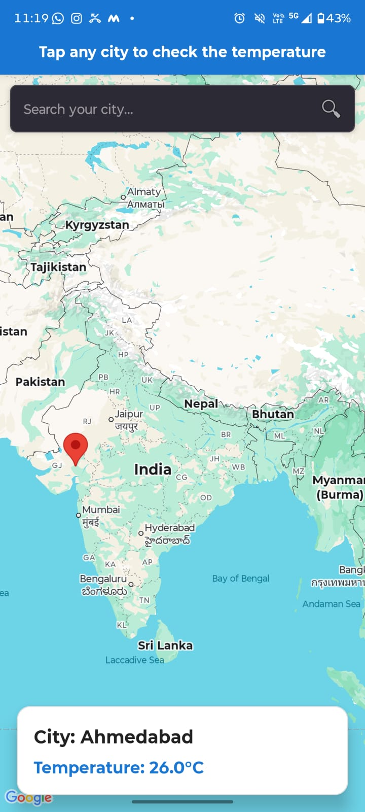
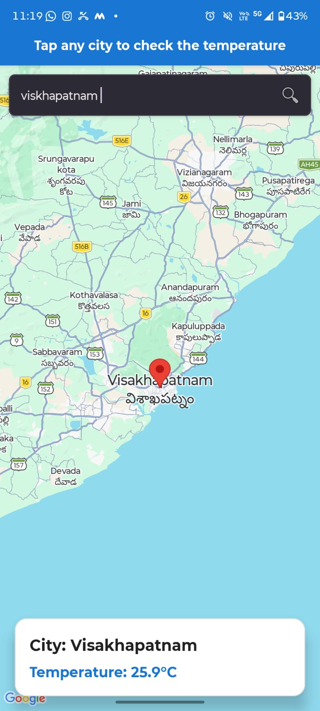

# 🌦️ Weather Map App

A simple Android app that shows real-time temperature using a city search or a location selected on Google Maps.

## ✨ Features

- 🔍 Search for a city
- 🗺️ Explore the map
- 📍 Tap any location to get its temperature
- 🌡️ View real-time temperature
- 📌 Show the selected location with a marker

## 📸 Screenshots

## 🛠️ Built With

- Java
- Android Studio
- XML
- Google Maps SDK
- OpenWeatherMap API
- JSON
- Geocoder

## 🚀 Run the App

1. Clone this repository.
2. Open it in Android Studio.
3. Add your Google Maps and OpenWeatherMap API keys.
4. Build and run the app on an Android device or emulator.

## 📥 Download

Get the latest APK from the **Releases** section.

## 👩‍💻 Author

**Spurthi**
